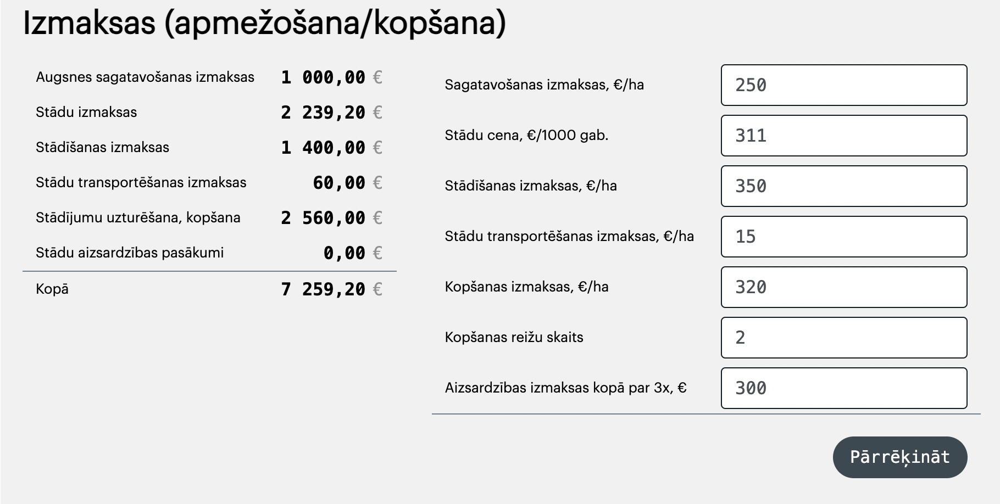

# CO2 Calculator front-app documentation
##### Updated: 2023.11.30.12:00, zl
##### Abstract
The code itself is hosted on dev server `co2-dev`. This document should help to contribute/update the code.


## Точки входа
https://co2-dev.pata.lv/lv  - клиент  
https://co2-dev.pata.lv/lv?v=test - админ  
https://co2-dev.pata.lv/lv?do=config - конфиг  

С передачей параметров:  
https://co2-dev.pata.lv/lv?do=brief&cn=70170020035&ha=4.1111&wd=birch&pe=0&v=  

## PDF Generation
https://co2-dev.pata.lv/lv?do=pdf&cn=70940030280&ha=4&wd=birch&pe=0&v=  
https://co2-dev.pata.lv/lv?do=pdf&cn=70940030280&ha=4&wd=birch&pe=0&v=test  
(URL параметр `v=test` покажет содержание в браузере вместо PDF файла)  

Кнопка «скачать PDF» генерирует первую ссылку выше и переходит по ней.

##### `/app/Views/wrapper.php`
```php
$propsAction = array_key_exists('do',$_GET) ? $_GET['do'] : '';
if ( $propsAction == 'pdf' ):
    // показать PDF...
    echo view('calculator/pdf');
else:
    // показать калькулятор...
```

```
calculator/pdf.php - entry point
calculator/pdf-template.php
calculator/pdf-templateStyles.php
```

#### Входные параметры
```
    $propsValuesHa = $_GET['ha'];   // площадь
    $propsValuesWood = $_GET['wd']; // codename дерева
    $propsCadastreNr = $_GET['cn']; // кадастровый номер
    $propsPriceEmi = $_GET['pe'];   // динамическая цена для третей таблицы
```

Генератор PDF не зависит от других файлов калькулятора.  
Конфиг и формулы скопированы и продублированы.  
Заново читает из базы информацию по кадастру.  


## Описание требований к калькулятору

### Калькулятор принимает
  

- площадь в гектарах
- сорт дерева, от которого зависят коэффиценты
- статичные коэффиценты (меняются только по редкому требованию бизнеса)
- динамичные дополнительные коэффиценты, объяснены ниже к таблицам для вывода

##### Форма и контроллер для входящих данных
- `section_CalcInputs.php`
- 


### Калькулятор отдаёт
Набор табличных данных. Содержание таблиц обсуждалось устно и обрастало деталями. Теущий код является единственным источником истины.


## Таблица 1: прибыль от вырубки

##### Таблица 1 для «клиента»
  

##### Таблица 1 для «админа»
  

##### Файлы с расчётами и рендерингом
- `section_OutputWoodcut.php` - клиент
- `section_OutputWoodcutMaster.php` - админ

Таблицы для юзера-клиента и для юзера-админа отличаются скрытыми/показанными полями. Код дублируется для обеих таблиц.

Строчки прописаны в конфиге для каждого сорта дерева:
```js
  woodtypes: {
    [WOODTYPE.BIRCH]: {
      // ...
      cuttingYears: [
          {
              year:  25,
              title: 'Krājas kopšanas cirte',
              volumePerSquare: 32.3,
              volumeModifyer: 0.3, // deprecated?
              price: 60.00,  // deprecated?
          },
```

## Таблица 2: прирост CO2

#### Таблица 2 для «клиента»
  

#### Таблица 2 для «админа»
  

##### Файлы с расчётами и рендерингом
- `section_OutputEmission.php` - клиент
- `section_OutputEmissionMaster.php` - админ

Таблицы для юзера-клиента и для юзера-админа отличаются скрытыми/показанными полями. Код дублируется для обеих таблиц.

Строчки заданы бизнесом («50 лет с шагом пять лет») и сохранены в конфиге:
```js
    const configGeneral = {
        // ...
        outputYears: [1,5,10,15,20,25,30,35,40,45,50],
```

Используется динамический коэффицент цены.

## Таблица 3: расчёт расходов
  

Дополнительная таблица только для админов. По сути - набор динамичных коэффицентов и суммарное число стоимости.


## File folders and structure
`public_html/app/Views/calculator`
- `_config.php`
- `_main.php`
- `script-*.php`
- `section-*.php`
- `style_common.php`

It's basically `html/javascript` code inside `php` files. Some PHP code is also provided.

Note: No resources from other folders are used for calculator app. Except main wrapper based on existed framework.

- `_config.php`
  Huge js-config file for all the bussiness requerments.

- `_main.php`
  Entry point and general flow.

- `script-*.php`
  Javascript code placed in separate files. Like `.js` files for html.

- `section-*.php`
Calculator parts placed in separate files and included in `_main.php`. Each section has html template and js function to render template.

- `style_common.php`
  CSS for current app.

## How to understand
The `_main.php` file has commented sections of the app flow. First goes rendering parts, then app controller to run/switch parts.

### App flow in brief
- Input cadastre number form
- Display cadastre data and geo map
- Input calculator values form
- Display calculated tables and graphs
