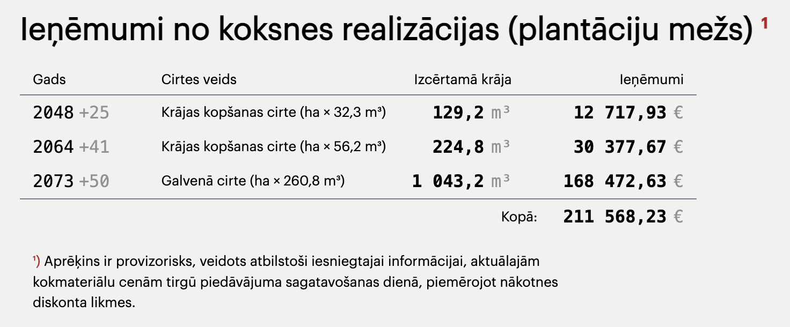
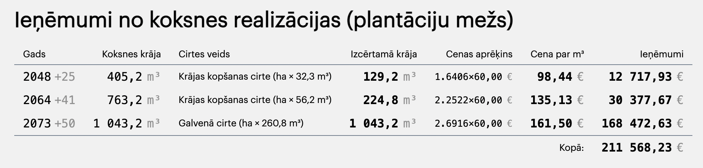
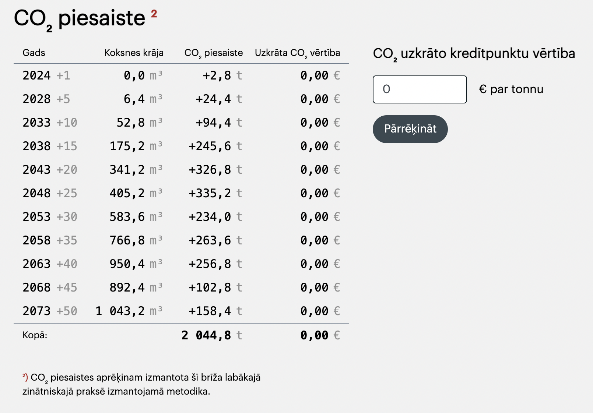
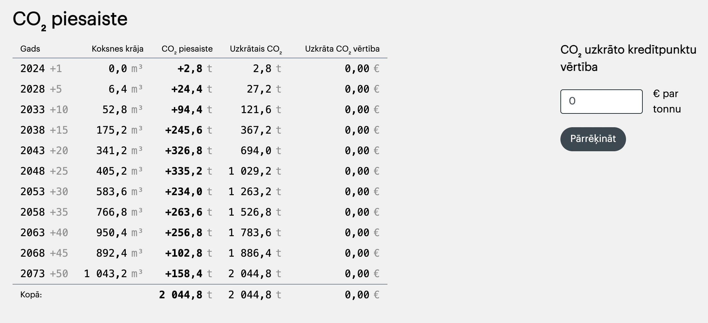

# CO2 Calculator front-app documentation
Updated: 2023.11.29, zl

## Abstract
The code itself is hosted on dev server `co2-dev`. This document should help to contribute/update the code.

## Описание требований к калькулятору

### Калькулятор принимает
- площадь в м²
- сорт дерева, от которого зависят коэффиценты
- статичные коэффиценты (меняются только по требованию бизнеса)
- динамичные коэффиценты, объяснены ниже к каждой таблице для вывода

### Калькулятор отдаёт
Набор табличных данных. Содержание таблиц обсуждалось устно и обрастало деталями. Теущий код является единственным источником истины.


## Таблица 1: прибыль от вырубки

##### Таблица 1 для «клиента»
  

##### Таблица 1 для «админа»
  

##### Файлы с расчётами и рендерингом
- `section_OutputWoodcut` - клиент
- `section_OutputWoodcutMaster` - админ

Таблицы для юзера-клиента и для юзера-админа отличаются скрытыми/показанными полями.

Строчки прописаны в конфиге для каждого сорта дерева:
```js
  woodtypes: {
    [WOODTYPE.BIRCH]: {
      // ...
      cuttingYears: [
          {
              year:  25,
              title: 'Krājas kopšanas cirte',
              volumePerSquare: 32.3,
              volumeModifyer: 0.3, // deprecated?
              price: 60.00,  // deprecated?
          },
```

## Таблица 2: прирост CO2

#### Таблица 2 для «клиента»
  

#### Таблица 2 для «админа»
  

##### Файлы с расчётами и рендерингом
- `section_OutputEmission` - клиент
- `section_OutputEmissionMaster` - админ

Таблицы для юзера-клиента и для юзера-админа отличаются скрытыми/показанными полями.

Строчки заданы бизнесом (50 лет с шагом пять лет) и сохранены в конфиге:
```js
    const configGeneral = {
        outputYears: [1,5,10,15,20,25,30,35,40,45,50],
```

Используется динамический коэффицент цены.


## File folders and structure
`public_html/app/Views/calculator`
- `_config.php`
- `_main.php`
- `script-*.php`
- `section-*.php`
- `style_common.php`

It's basically `html/javascript` code inside `php` files. Some PHP code is also provided.

Note: No resources from other folders are used for calculator app. Except main wrapper based on existed framework.

- `_config.php`
  Huge js-config file for all the bussiness requerments.

- `_main.php`
  Entry point and general flow.

- `script-*.php`
  Javascript code placed in separate files. Like `.js` files for html.

- `section-*.php`
Calculator parts placed in separate files and included in `_main.php`. Each section has html template and js function to render template.

- `style_common.php`
  CSS for current app.

## How to understand
The `_main.php` file has commented sections of the app flow. First goes rendering parts, then app controller to run/switch parts.

### App flow in brief
- Input cadastre number form
- Display cadastre data and geo map
- Input calculator values form
- Display calculated tables and graphs
